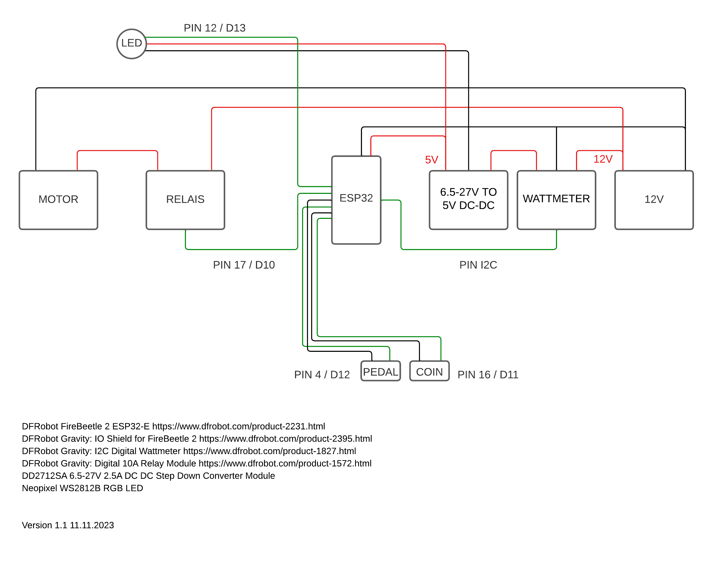

# Bumper Car Controller

Project to control a bumper car using a ESP32 microcontroller.
The car is using a 12V car battery to run a Bosch starter motor.
When a coin is inserted in a coin acceptor a pedal becomes active to drive the car.

## Getting Started

These are the key compnents used.

### Components
 
- [DFRobot FireBeetle 2 ESP32-E](https://www.dfrobot.com/product-2231.html)
- [DFRobot Gravity: IO Shield for FireBeetle 2](https://www.dfrobot.com/product-2395.html)
- [DFRobot Gravity: I2C Digital Wattmeter](https://www.dfrobot.com/product-1827.html)
- [DFRobot Gravity: Digital 10A Relay Module](https://www.dfrobot.com/product-1572.html)
- WS2812B RGB LEDs
- DD2712SA 6.5-27V 2.5A DC DC Step Down Converter Module
- Generic coin acceptor
- Magnetic contact switch for the pedal

### Wiring diagram

### Definitions

Important definitions to change in main.cpp

- `#define DEBUG` This will print debug messages on the serial monitor. Set to 1 to enable or 0 to disable.
- `#define NUM_EXTERNAL_LEDS` Set the number of LEDs connected.
- `#define BRIGHTNESS` Set the brightness for all LEDs to a value between 0 and 255.
- `float batteryCutoffVoltage` This defines the voltage to disable the car to protect the battery from discharging too low.
- `float batteryLowVoltage` Set the minimum voltage of the battery required to start a ride.
- `const long rideDuration` This is the duration of one ride in milliseconds.
